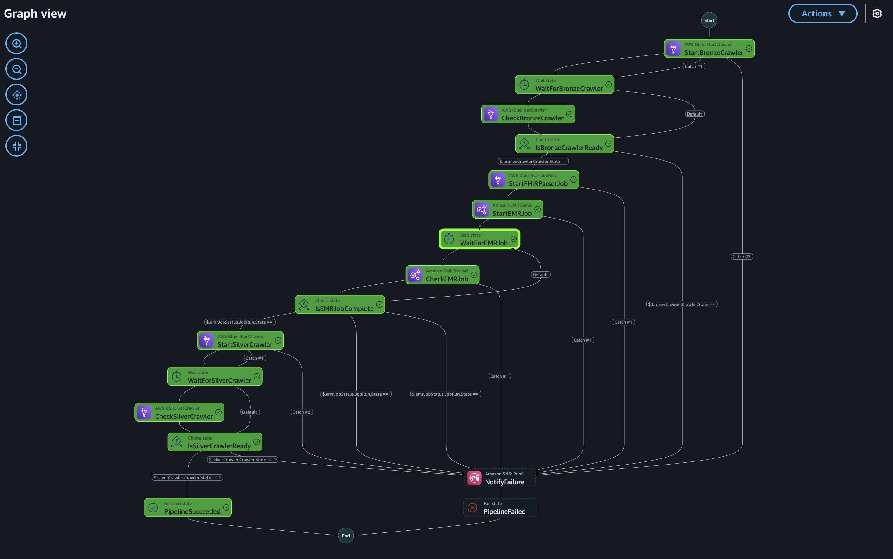
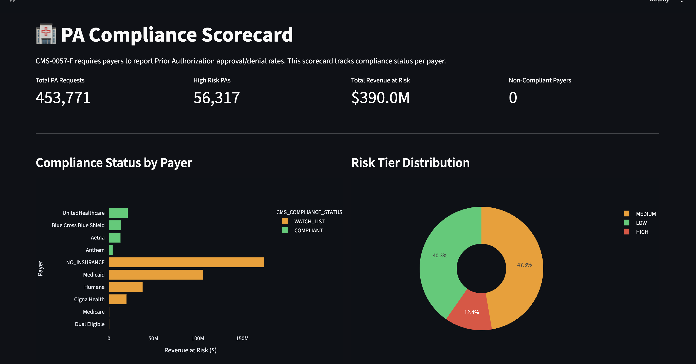
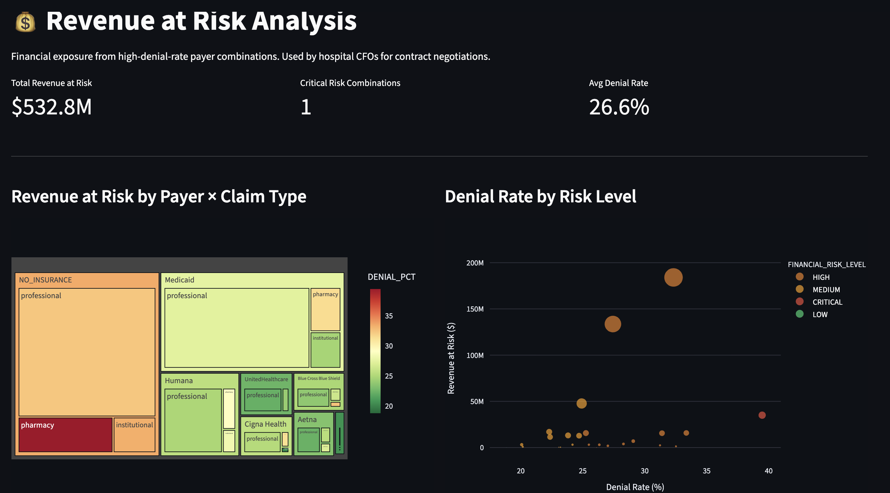
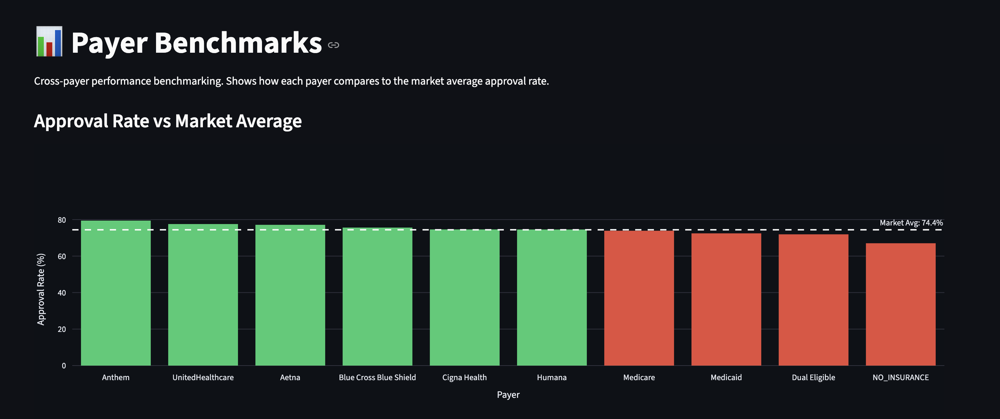
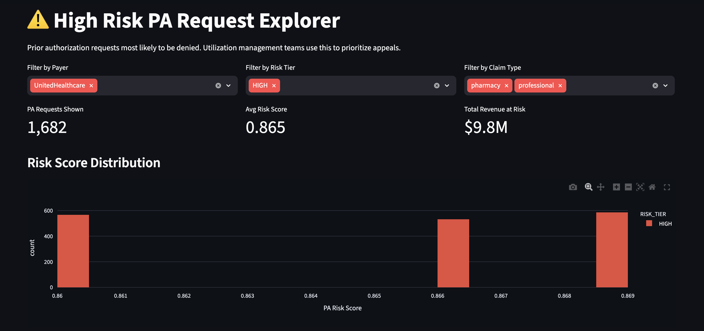
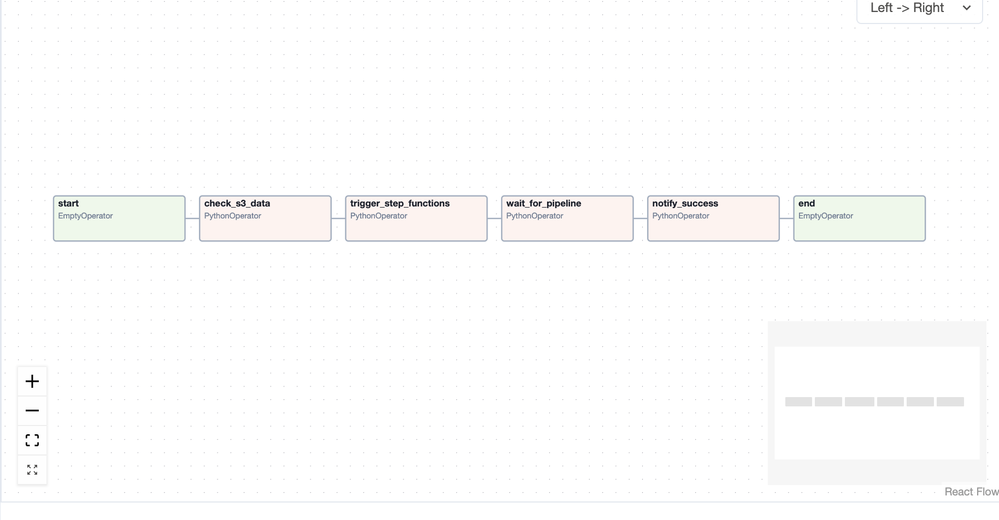
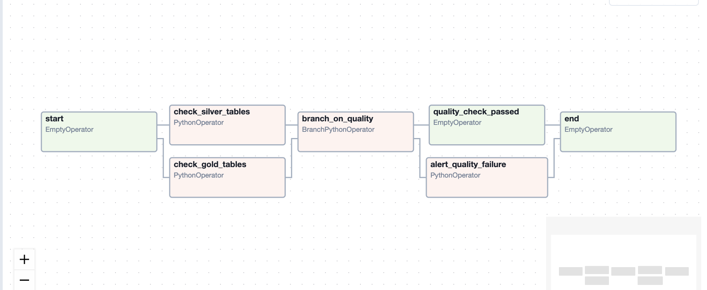

# PACIP — Prior Authorization & Claims Intelligence Platform

[](https://aws.amazon.com)
[](https://snowflake.com)
[](https://getdbt.com)
[](https://pacip-dashboard.onrender.com)
[](https://airflow.apache.org)

> End-to-end AWS data platform processing **453,771 real-scale synthetic Medicare-equivalent records** to benchmark payer billing behavior, compute Prior Authorization risk scores, and surface **$174M in revenue at risk** — architecture aligned with the **CMS-0057-F Prior Authorization mandate** (effective January 2026, FHIR API compliance January 2027).

**[Live Dashboard →](https://pacip-dashboard.onrender.com)**

---

## Why this project exists

CMS-0057-F (effective January 1, 2026) requires Medicare Advantage, Medicaid, and ACA marketplace payers to:
- Decide standard Prior Authorization requests within **7 calendar days**
- Give a **specific reason for every denial**
- Expose PA data via **FHIR R4 APIs** (January 2027 deadline)

Every US health payer is building this infrastructure right now. PACIP is a production-grade reference implementation of the data engineering stack behind it.

---

## Architecture


---
## Screenshots

### AWS Step Functions — Pipeline execution (all 14 states green)


### PA Compliance Scorecard — 453,771 PA requests · $390M revenue at risk


### Revenue at Risk Analysis — $532M exposure · treemap by payer × claim type


### Payer Benchmarks — Anthem #1 at 79.5% · market avg 74.4%


### High Risk PA Explorer — 1,682 UnitedHealthcare HIGH-risk PAs · avg risk score 0.865


### Airflow — Ingestion pipeline DAG (weekly · triggers Step Functions)


### Airflow — Quality monitoring DAG (daily · parallel Silver + Gold checks · SNS alert branch)


---
## Tech stack

| Layer | Technology | Purpose |
|---|---|---|
| Data source | Synthea FHIR R4 | 5K synthetic patients, 5 states, FHIR R4 bundles |
| Orchestration | MWAA (Airflow) | Weekly ingestion DAG + daily quality monitoring DAG |
| Workflow | AWS Step Functions | 14-state pipeline with retry logic + SNS failure alerts |
| Cataloging | AWS Glue Crawlers | Auto-schema inference on Bronze and Silver zones |
| ETL | AWS Glue PySpark | FHIR parser: wholeTextFiles + json.loads, contained resource extraction |
| Scoring | EMR Serverless PySpark | PA risk scoring: patient-payer profiling + 3-tier risk classification |
| Storage | Amazon S3 | Bronze/Silver/Gold medallion architecture |
| Warehouse | Redshift Serverless | Spectrum external schema on Glue catalog, no data copying |
| Transformation | dbt | 3 staging models + 4 analytical mart tables |
| Data sharing | Snowflake | Secure Data Share: simulates CMS Payer-to-Payer FHIR mandate |
| Dashboard | Streamlit on Render | Live PA compliance scorecard + revenue at risk explorer |

---

## Pipeline modules

### Module 1 — Data generation
Synthea FHIR R4 generator produces 5,000 synthetic patients across New York, Florida, Texas, California, and Illinois with 10 years of medical history. Output: 5,000 FHIR JSON bundle files uploaded to S3 Bronze zone.

### Module 2 — Glue FHIR parser
PySpark job reads all 5,000 bundles via `wholeTextFiles` + Python `json.loads` (bypasses Spark schema inference on polymorphic FHIR JSON). Extracts 7 resource types including **contained resources** (Coverage and ServiceRequest are embedded inside ExplanationOfBenefit in Synthea output — a production-grade parsing challenge).

**Silver tables:**
| Table | Rows |
|---|---|
| patients | 4,678 |
| claims | 453,771 |
| explanations (EOB) | 453,771 |
| coverages | 453,771 |
| encounters | 253,896 |
| conditions | 160,434 |
| prior_auth (ServiceRequest) | 453,771 |

### Module 3 — EMR Serverless PA risk scoring
PySpark job joins Silver tables to build patient-payer profiles, computes historical approval rates by claim type × payer, and assigns each PA request a risk score (0.0–1.0) based on historical denial probability.

**Gold tables:**
| Table | Rows | Key insight |
|---|---|---|
| pa_risk_scores | 453,771 | 56,317 HIGH-risk PAs identified |
| procedure_approval_rates | 27 | Approval rates by claim type × payer |
| payer_performance | 10 | NO_INSURANCE: 33% denial rate, $174M revenue at risk |

### Module 4 — Step Functions orchestration
14-state machine: Bronze Crawler → Glue FHIR Parser (`.sync` wait) → EMR Serverless polling loop → Silver Crawler. Retry logic on every compute state, failure branching to SNS alert, all states completed green on first execution.

### Module 5 — Redshift Serverless + dbt
Redshift Spectrum reads S3 Parquet directly via Glue catalog (no COPY commands, no data duplication). dbt builds 4 analytical marts on top.

| dbt Mart | Description |
|---|---|
| `mart_pa_compliance_scorecard` | CMS-0057-F compliance status per payer (COMPLIANT / WATCH_LIST / NON_COMPLIANT_HIGH_DENIAL) |
| `mart_revenue_at_risk` | Financial exposure by claim type × payer with recovery potential at 80% approval |
| `mart_payer_benchmarks` | Cross-payer approval rate ranking vs market median |
| `mart_high_risk_pa_requests` | PA requests flagged with recommended action (IMMEDIATE_APPEAL / APPEAL / MONITOR) |

### Module 6 — MWAA (Airflow) DAGs
Two DAGs validated locally and deployed to S3 for MWAA:
- `pacip_ingestion_pipeline`: weekly, S3 sensor → Step Functions trigger → SNS success notification
- `pacip_quality_monitoring`: daily, Athena count checks on all 10 tables with threshold validation → SNS alert on failure

### Module 7 — Snowflake + Streamlit
S3 Gold Parquet loaded into Snowflake via external stage + storage integration. Three **Secure Views** shared via Snowflake Secure Data Share — simulating the CMS-0057-F Payer-to-Payer FHIR data sharing requirement. Streamlit dashboard reads from Snowflake analytics schema.

---

## Key findings

- **NO_INSURANCE** payer has the highest denial rate at **33%** and **$174M revenue at risk**
- **Anthem** has the best approval rate at **79.5%**
- **56,317 PA requests** classified as HIGH risk (pa_risk_score ≥ 0.70)
- **10 payer profiles** benchmarked across 3 claim types (professional / institutional / pharmacy)

---

## Cost

Total AWS spend to build this project: **~$12** (using $200 new account credits + separate $300 Redshift Serverless trial). Snowflake: free trial ($400 / 30 days). Streamlit: deployed on Render free tier.

---

## Local setup

```bash
# Clone
git clone https://github.com/Nayan2701/PACIP-Healthcare-Analytics.git
cd PACIP-Healthcare-Analytics

# Install dependencies
pip install streamlit snowflake-connector-python plotly pandas

# Configure Snowflake credentials
mkdir -p ~/.streamlit
cat > ~/.streamlit/secrets.toml << 'SECRETS'
[snowflake]
user = "YOUR_USER"
password = "YOUR_PASSWORD"
account = "YOUR_ACCOUNT"
SECRETS

# Run dashboard
python3 -m streamlit run app.py
```

---

## Repo structure

```
PACIP-Healthcare-Analytics/
├── app.py                    # Streamlit dashboard
├── requirements.txt          # Python dependencies
├── glue_jobs/
│   └── fhir_parser.py        # AWS Glue FHIR parser (PySpark)
├── emr_jobs/
│   └── pa_risk_scoring.py    # EMR Serverless PA risk scoring (PySpark)
├── airflow/dags/
│   ├── pacip_ingestion_dag.py
│   └── pacip_quality_dag.py
├── dbt/pacip_dbt/
│   ├── models/staging/       # stg_pa_risk_scores, stg_payer_performance, stg_approval_rates
│   └── models/marts/         # 4 analytical mart tables
└── README.md
```
---

## Target roles

This project is directly relevant to:
- **Healthcare payer DE roles** (UnitedHealth/Optum, Aetna, Cigna, Humana, Change Healthcare) — FHIR pipeline, claims data, PA analytics
- **Health IT platform roles** (Waystar, Availity, Innovaccer, Cotiviti) — clearinghouse and claims processing architecture
- **Financial sector healthcare analytics** (JPMorgan Healthcare Finance, Deloitte Healthcare Practice) — revenue cycle intelligence, payer financial risk
- **AWS HealthLake implementations** — FHIR-native S3/Glue/EMR/Redshift stack

---

## Author

**Nayan Paliwal** | MS Engineering Science (Data Science), University at Buffalo  
[LinkedIn](https://linkedin.com/in/nayan-paliwal) · [GitHub](https://github.com/Nayan2701)
